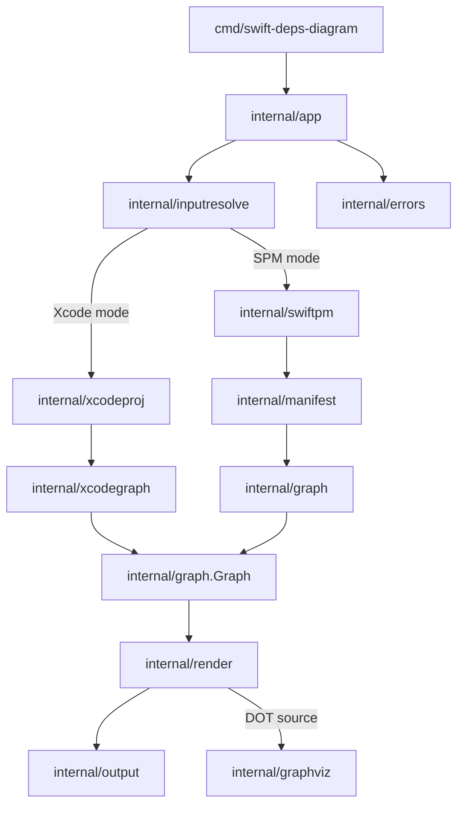

# Architecture and Modules

This document describes the runtime architecture of `swift-deps-diagram` and the responsibility of each module.

## High-Level Flow

## Runtime Responsibilities

1. CLI parses and validates user flags.
2. App resolves input source (`spm` or `xcode`).
3. App builds a common graph model from the selected source pipeline.
4. Renderers convert the graph into Mermaid and/or DOT text.
5. Output layer writes text output; Graphviz layer optionally writes PNG.
6. Error layer maps failures to stable exit codes.

## Module Catalog

### `cmd/swift-deps-diagram`
- Entry point and CLI flag parsing.
- Passes validated options into `internal/app.Run`.
- Converts returned typed errors into process exit codes.

### `internal/app`
- Orchestration layer.
- Validates options, resolves mode, runs data extraction pipeline, renders output, writes files/stdout, and optionally triggers PNG generation.
- Central integration point for all internal modules.

### `internal/inputresolve`
- Detects and resolves input in `auto|spm|xcode` mode.
- Rules:
  - `auto`: prefer `.xcworkspace` / `.xcodeproj`, fallback to `Package.swift`.
  - supports explicit `--project` and `--workspace`.
- Returns a normalized `Resolved` input contract.

### `internal/swiftpm`
- Executes `swift package dump-package --package-path ...`.
- Handles command timeout, stderr capture, and typed failures.
- Produces raw JSON bytes for manifest decoding.

### `internal/manifest`
- Decodes SwiftPM JSON into strongly typed structures.
- Normalizes target dependency variants (`target`, `product`, `byName`).
- Provides package model consumed by graph builder.

### `internal/graph`
- Defines canonical graph model used by all outputs.
- Builds graph from SwiftPM manifest model.
- Handles node/edge creation, deduplication, test-target filtering, and deterministic ordering.

### `internal/xcodeproj`
- Loads and parses `.xcodeproj/project.pbxproj` using `plutil` JSON conversion.
- Extracts:
  - targets
  - target dependencies
  - Swift package product dependencies
  - package identity hints
- Produces normalized Xcode project model.

### `internal/xcodegraph`
- Adapts parsed Xcode project model into the canonical `internal/graph.Graph`.
- Maps Xcode target and package-product relationships to graph nodes/edges.
- Applies test-target filtering for Xcode mode.

### `internal/render`
- Converts canonical graph into text formats:
  - Mermaid (`flowchart TD`)
  - Graphviz DOT (`digraph`)
- Ensures stable deterministic output and safe label escaping.

### `internal/output`
- Writes diagram text to stdout or atomically to file.
- Creates destination directories and uses temp-file rename for safer writes.

### `internal/graphviz`
- Optionally generates PNG from DOT source via `dot -Tpng`.
- Validates Graphviz availability and wraps render errors with typed kinds.

### `internal/errors`
- Defines typed error kinds for user/runtime/tooling failures.
- Provides helpers for kind checks and consistent exit-code mapping.
- Exit codes:
  - `1`: invalid input/args/not-found
  - `2`: runtime/parse/tool failures

### `internal/testutil`
- Test-only helpers for fixture and repository path handling.
- Keeps tests concise and consistent.

## Core Internal Contracts

- Canonical graph type: `internal/graph.Graph`
- App entrypoint: `internal/app.Run(ctx, opts, stdout)`
- Input resolver: `internal/inputresolve.Resolve(Request) -> Resolved`

These contracts keep source-specific parsing (SwiftPM/Xcode) decoupled from rendering/output behavior.
